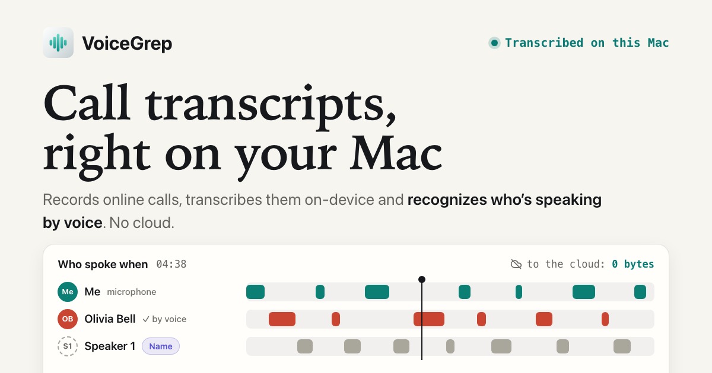

# VoiceGrep

**Call transcripts, right on your Mac.**

Records online calls, transcribes them on-device and recognizes who's speaking by voice. No cloud.

[%3D%27shortVersionString%27%5D&label=version&color=0e7c6b)](https://voicegrep.com/en/)

**[Download for macOS](https://voicegrep.com/VoiceGrep-1.10.0.dmg)** ·
[voicegrep.com](https://voicegrep.com/en/) ·
[По-русски](README.md)

VoiceGrep lives in the menu bar and notices on its own when a call starts. It records two tracks — system
audio and the microphone — and when the call ends, it turns them into text right on the Mac and labels who
said what. Name a person once, and their voice is recognized in every meeting after that.

> **Heads-up:** VoiceGrep is built for Russian first; English is supported too — switch the meeting
> language in Settings or let it auto-detect. The interface, summaries and tasks are in Russian for now;
> the assistant can answer in English.

## What it does

**Recording**
- **Starts and stops on its own.** The call begins — recording starts; the call ends — it stops. Five
  calls back to back become five meetings.
- **Only the call's audio.** When recording automatically, VoiceGrep aims to capture just the call app:
  music and random pings from other apps stay out.
- **Marks during the call.** A floating panel with a timer (turn it on in Settings): Important, Question,
  Task, Decision, notes and screenshots — each pinned to its moment in the conversation.

**Transcripts and voices**
- **On-device transcription.** Two engines to choose from — Parakeet (default, faster) and Whisper.
- **Recognition by voice.** “Me” is the microphone. Everyone else VoiceGrep tells apart itself: name a
  speaker once, and their lines are labeled here and in every future meeting.
- **Fixes in a couple of clicks.** Reassign a line, split it, merge two speakers, correct a wrong match.

**After the call**
- **Search** within a meeting: only the lines with your word remain, and you can filter by speaker.
- **An assistant over the whole archive:** “what did we agree with Sam?”, “what are my tasks?” — it
  searches the transcripts, even by sound, and answers with links back to the conversations.
- **Summaries and tasks with owners.** VoiceGrep only suggests tasks; you confirm the ones you want.
  The assistant, summaries and tasks need a language model — see [Privacy](#privacy).
- **People and projects.** A card for every person — role, company, notes; a graph of who meets with
  whom; meetings grouped into projects.
- **Import and export.** Bring in a recording you already have (audio or video) — it's transcribed and
  split by voice. Export any meeting to Markdown or as a single audio file, and move voiceprints to another Mac.
- **Your archive in other AI clients.** Optionally, VoiceGrep serves the archive over MCP to Claude
  Desktop, Claude Code, Cursor and others. Off by default.

**Reliability**
- A meeting exists from the first second of recording; after a crash the recording is recovered and
  transcribed.
- The database backs itself up regularly.

## Privacy

Recording, transcription and voice recognition all run on the device. That's not a checkbox you could
untick by accident — it's how the app is built.

| What                     | Where                                            |
|--------------------------|--------------------------------------------------|
| Call audio               | on this Mac                                      |
| Transcript               | on this Mac                                      |
| Voiceprints              | on this Mac                                      |
| Language model           | not connected; opt-in — local, your API key or your subscription |
| Sent to the cloud        | **0 bytes**, unless you connect a cloud model yourself |

**Why VoiceGrep goes online:** to download the speech model once (0.6–1 GB), to check for updates and —
only if you connected one — to reach a language model. You can connect:

- **a local model** (Ollama, LM Studio) — then meeting text never leaves the Mac either;
- **a provider's API** with your own key or **your own subscription** via CLI (`claude` / `codex`) — then
  transcript text (not audio, not voices) goes to that provider.

The same applies to serving the archive over MCP: a client such as Claude Desktop sends what it reads to
its own model.

**Permissions:** Microphone and Screen Recording. The latter is only how macOS lets an app capture the
call's system audio — no screen video is ever saved, only screenshots you take yourself.

## Install

1. **[Download the .dmg](https://voicegrep.com/VoiceGrep-1.10.0.dmg)** (about 23 MB).
2. Open it and drag VoiceGrep into Applications.
3. Launch it. The first-run setup asks for Microphone and Screen Recording access, and the speech model
   downloads in the background.

The app is signed with Developer ID and notarized by Apple — no Terminal commands needed.

**Requirements:** a Mac with Apple Silicon (M1 or later), macOS 14.4 or later.

**Activation key.** VoiceGrep is free, but recording or importing new meetings needs a key — tied to your
Mac and valid for a set period. Open Settings → License (“Настройки → Лицензия”), copy the machine ID
(“ID машины”) and [message us on Telegram](https://t.me/ilyabazheno) — we'll send a key. The app reminds
you 14 days before it expires; a new Mac needs a new key. Without one, everything already recorded stays
available: play, search, export, ask the assistant.

**Model won't download** (it happens with some ISPs or VPNs)? Download `parakeet-tdt-0.6b-v3-int8.zip`
from [Releases → ML models](../../releases/tag/models-fluidaudio-0.15.4) and install it via Settings →
Transcription → “Установить из файла…” (Install from file) — this works for the default Parakeet engine.

## Updates

VoiceGrep checks for updates itself and installs them once you confirm (Sparkle; updates are
EdDSA-signed). To check manually, use “Проверить обновления…” (Check for Updates) in VoiceGrep's menu-bar menu.

## Feedback

Found a bug, need a key or have an idea — [message us on Telegram](https://t.me/ilyabazheno).

If you attach anything, **please don't send recordings or transcripts of other people's conversations**
without their consent. To look into a problem, the VoiceGrep and macOS versions, the steps you took and
the meeting's “Диагностика обработки” (processing diagnostics, in the “···” menu on a meeting card) are usually enough.

## What's in this repository

The app's source is closed. This repository holds what's distributed publicly:

| File | What it is |
|---|---|
| [`index.html`](index.html), [`en/`](en/) | The [voicegrep.com](https://voicegrep.com/) website (GitHub Pages) |
| `VoiceGrep-<version>.dmg` | The latest build; older ones are removed when a new one ships |
| [`appcast.xml`](appcast.xml) | The update feed the app polls |
| [`open.html`](open.html) | Forwarding page for `voicegrep://` meeting links |
| [Releases](../../releases) | Mirror of the ML models the app downloads |

---

VoiceGrep — private, on-device call transcription for macOS. By default, all your data stays on your Mac.

