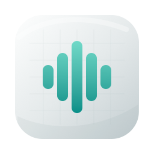
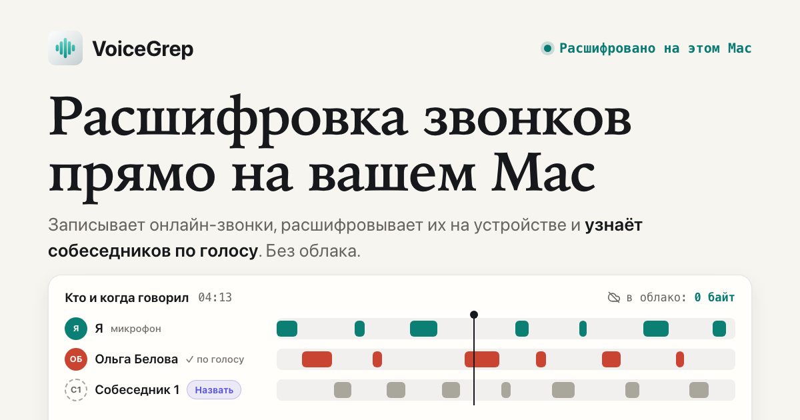

# VoiceGrep

**Расшифровка звонков прямо на вашем Mac.**

Записывает онлайн-звонки, расшифровывает их на устройстве и узнаёт собеседников по голосу. Без облака.

[%3D%27shortVersionString%27%5D&label=%D0%B2%D0%B5%D1%80%D1%81%D0%B8%D1%8F&color=0e7c6b)](https://voicegrep.com/)

**[Скачать для macOS](https://voicegrep.com/VoiceGrep-1.10.0.dmg)** ·
[voicegrep.com](https://voicegrep.com/) ·
[English](README.en.md)

VoiceGrep живёт в строке меню и сам замечает, когда начинается звонок. Пишет две дорожки — системный
звук и микрофон, а когда звонок заканчивается, прямо на Mac превращает их в текст и подписывает, кто что
сказал. Человека достаточно назвать один раз: дальше его голос узнаётся на всех следующих встречах.

Лучше всего работает с русской речью, английский тоже поддерживается. Интерфейс — на русском.

## Что умеет

**Запись**
- **Сама начинает и сама заканчивает.** Звонок начался — запись пошла, закончился — остановилась.
  Пять звонков подряд разрезаются на пять встреч.
- **Только звук звонка.** При автозаписи VoiceGrep старается писать лишь приложение звонка: музыка и
  «дзынь» из других программ в запись не попадают.
- **Отметки по ходу разговора.** Плавающая панель с таймером (включается в настройках): «Важно», «Вопрос», «Задача», «Решение»,
  заметки и скриншоты — всё привязано к моменту звонка.

**Расшифровка и голоса**
- **Расшифровка на устройстве.** Два движка на выбор — Parakeet (по умолчанию, быстрее) и Whisper.
- **Узнавание по голосу.** «Я» — это микрофон. Остальных VoiceGrep различает сам: назовите собеседника
  один раз, и его реплики будут подписаны здесь и во всех следующих встречах.
- **Правки — в пару кликов.** Переназначить реплику, разделить её, объединить двух собеседников, поправить
  неверно узнанного.

**После звонка**
- **Поиск** по встрече: остаются только реплики с нужным словом, можно отфильтровать по участникам.
- **Ассистент по всему архиву:** «о чём договорились с Сергеем?», «какие у меня задачи?» — ищет по
  расшифровкам, даже по звучанию, и отвечает со ссылками на разговоры.
- **Саммари и задачи с исполнителями.** Задачи VoiceGrep только предлагает — нужные подтверждаете вы.
  Ассистенту, саммари и задачам нужна языковая модель — см. [Приватность](#приватность).
- **Люди и проекты.** Карточка на каждого человека — роль, компания, заметки; граф «кто с кем
  созванивается»; встречи раскладываются по проектам.
- **Импорт и экспорт.** Загрузите готовую запись (аудио или видео) — она расшифруется и разложится по голосам. Любую
  встречу можно выгрузить в Markdown или одним аудиофайлом, а отпечатки голосов — перенести на другой Mac.
- **Архив для внешних ИИ-клиентов.** По желанию VoiceGrep отдаёт архив по MCP — в Claude Desktop, Claude
  Code, Cursor и другие клиенты. По умолчанию выключено.

**Надёжность**
- Встреча создаётся с первой секунды записи; после сбоя запись восстанавливается и дорасшифровывается.
- База сама регулярно сохраняет снимки.

## Приватность

Запись, расшифровка и узнавание голосов работают на устройстве. Это не галочка в настройках, которую можно
случайно снять: приложение так устроено.

| Что                      | Где                                              |
|--------------------------|--------------------------------------------------|
| Аудио звонка             | на этом Mac                                      |
| Расшифровка              | на этом Mac                                      |
| Отпечатки голосов        | на этом Mac                                      |
| Языковая модель          | не подключена; по желанию — локальная, ваш ключ API или подписка |
| Ушло в облако            | **0 байт**, пока вы сами не подключите облачную модель |

**Зачем VoiceGrep ходит в сеть:** один раз скачать модель распознавания речи (0,6–1 ГБ), проверять
обновления и — только если вы её подключили — обращаться к языковой модели. Подключить можно:

- **локальную модель** (Ollama, LM Studio) — тогда и тексты встреч не покидают Mac;
- **API провайдера** своим ключом или **свою подписку** через CLI (`claude` / `codex`) — тогда текст
  расшифровок (не аудио и не голоса) уходит этому провайдеру.

То же касается выдачи архива по MCP: клиент вроде Claude Desktop отправляет прочитанное своей модели.

**Разрешения:** «Микрофон» и «Запись экрана». Второе нужно только для того, чтобы macOS отдала звук
звонка: видео экрана VoiceGrep не сохраняет — только скриншоты, которые вы сделали сами.

## Установка

1. **[Скачайте .dmg](https://voicegrep.com/VoiceGrep-1.10.0.dmg)** (около 23 МБ).
2. Откройте его и перетащите VoiceGrep в «Программы».
3. Запустите. Мастер первого запуска попросит доступ к микрофону и записи экрана, а модель распознавания
   скачается сама в фоне.

Приложение подписано Developer ID и заверено Apple — команды в Терминале не нужны.

**Требования:** Mac на Apple Silicon (M1 и новее), macOS 14.4 или новее.

**Ключ активации.** VoiceGrep бесплатный, но для записи и импорта новых встреч нужен ключ — он привязан к
компьютеру и выдаётся на срок. Откройте «Настройки → Лицензия», скопируйте «ID машины» и
[напишите в Telegram](https://t.me/ilyabazheno) — пришлём ключ. За 14 дней до конца срока приложение
напомнит о продлении; на новом Mac понадобится новый ключ. Без ключа всё уже записанное остаётся
доступным: слушать, искать, экспортировать, спрашивать ассистента.

**Модель не скачивается** (бывает из-за провайдера или VPN)? Скачайте `parakeet-tdt-0.6b-v3-int8.zip`
из [Releases → ML-модели](../../releases/tag/models-fluidaudio-0.15.4) и установите через «Настройки →
Транскрипция → Установить из файла…» (работает для движка Parakeet, он стоит по умолчанию).

## Обновления

VoiceGrep проверяет обновления сам и ставит их после вашего подтверждения (Sparkle; обновления подписаны
EdDSA). Проверить вручную — «Проверить обновления…» в меню VoiceGrep в строке меню.

## Обратная связь

Нашли ошибку, нужен ключ или есть идея — [пишите в Telegram](https://t.me/ilyabazheno).

Если прикладываете материалы, **не присылайте записи и расшифровки чужих разговоров** без согласия
собеседников. Для разбора проблемы обычно хватает версии VoiceGrep и macOS, описания шагов и
«Диагностики обработки» из меню «···» карточки встречи.

## Что лежит в этом репозитории

Код приложения закрыт. Здесь — то, что раздаётся наружу:

| Файл | Что это |
|---|---|
| [`index.html`](index.html), [`en/`](en/) | Сайт [voicegrep.com](https://voicegrep.com/) (GitHub Pages) |
| `VoiceGrep-<версия>.dmg` | Последняя сборка; старые удаляются при выходе новой |
| [`appcast.xml`](appcast.xml) | Лента обновлений, которую опрашивает приложение |
| [`open.html`](open.html) | Переадресация ссылок на встречи `voicegrep://` |
| [Releases](../../releases) | Зеркало ML-моделей для скачивания из приложения |

---

VoiceGrep — локальная запись и расшифровка звонков для macOS. По умолчанию все данные остаются на вашем Mac.

